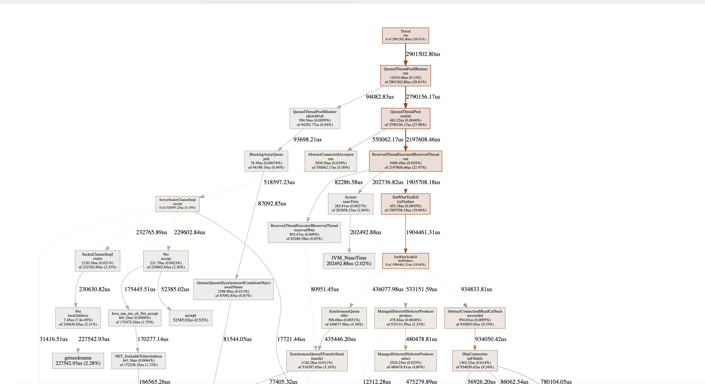
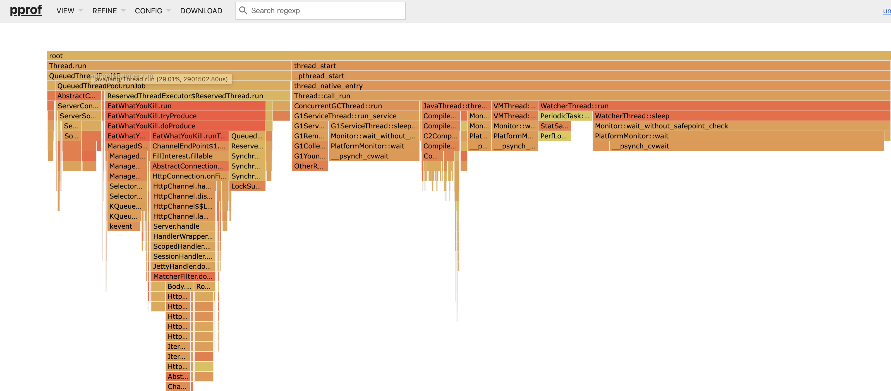

# spark with jpprof


## Running

* wathing

```shell
go tool pprof -http :6060 http://localhost:9999/debug/pprof/profile\?seconds\=10
```

* do some load testing

```shell
ab -n 4000 -c 100 http://localhost:9999/demo
```


## some images




